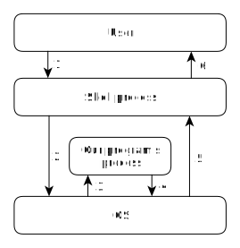

# Explaining the first program in C

In previous article we've learned how to use C compiler and wrote our first program in C that does nothing.
Now it's time for me to explain everything we did in more details.

Contents:

* What that piece of code means
* Why we need "compilation"
* Explaining the compilation command
* How our code looks like after compilation (Advanced)
* What happens when we execute the program
* Conclusion

## What that piece of code means

	void main()
	{
	}

We don't know yet anything about coding in C, so for now I'll just explain it very briefly.
These 3 lines only tell the C compiler that we don't have anything useful to do yet - it's an empty program.

* `main` is the starting function - it's the point where execution of our code begins.
* Empty `()` brackets mean that our function doesn't have any parameters.
* `void` means that our function doesn't have anything to return to its caller.
* Empty `{}` braces mean that we don't have any code inside our function.

Don't worry if you don't understand something - we'll dive deeper into C syntax later.

## Why we need "compilation"

We can't execute a C code directly, because CPU doesn't understand it.
If you try to execute a file with `.c` extension, it won't work.
That's why we need to translate our C code which we, humans, understand better, into a special code that CPU understands (while being much more difficult for humans) - we need "compilation".

> Compilation is a process of transforming the human-readable text into a machine-readable binary code.

> C compiler is a program that performs such process on code written in C language.

So when we take a text file with `.c` extension and feed it to a C compiler, it produces a binary code which CPU can actually understand.
However, in reality the things here are a little bit more complicated, but for now we only need to know that without compilation we can't run our C code.

## Explaining the compilation command

	gcc p1.c -o p1

* We execute a program `gcc` - a C compiler.
* We pass `p1.c` file - our C code - as an input file to `gcc`.
* And we want `gcc` to create an output file `p1` - a binary file which we going to execute.

There are many different options that `gcc` accepts, but we don't need anything else now.

## How our code looks like after compilation (Advanced)

Oh, you like to dig deep, don't you?
Let's disassemble our binary file so that we can see its CPU instructions.  Type:

	objdump -d ./p1

Somewhere within the lines that `objdump` has just printed we can find this:

	...
	0000000000401106 <main>:
	401106:       55                      push   %rbp
	401107:       48 89 e5                mov    %rsp,%rbp
	40110a:       90                      nop
	40110b:       5d                      pop    %rbp
	40110c:       c3                      retq
	40110d:       0f 1f 00                nopl   (%rax)
	...

So this is how machine-readable code of our `main` function looks like? 
Well, the 2nd column with numbers only - yes.  It's called "byte code".
And that's why C language is so useful - it's too difficult to write native code without it. 
The 3rd column is a human-readable form of those numbers.  This text is in Assembler language. 
The 1st column is an address (like a unique ID) of a particular instruction.

Note that in your case this data may be different - it depends on compiler and target CPU.
These instructions were generated by C compiler automatically.
And since we didn't write any code inside our `main` function, there's nothing much to talk about here.

## What happens when we execute the program

Remember how we did it?  In console app we typed this command:

	./p1

We execute the program by executing the binary file that C compiler created for us.
Let's see what exactly happens step by step:

1. In console app we type command to execute a binary file (i.e. `./p1`).
2. Shell program which is running inside console app receives our command and passes it to OS.
3. OS makes necessary preparations for our program to work correctly and then CPU starts to execute instructions from our program.
4. When our program finishes its job, it asks OS to shut it down.
5. OS frees the resources associated with our program and notifies Shell program ("parent") that our program ("child") has exited.
6. Shell program receives the signal from OS and returns the control back to us.

Of course, this process is more complicated in real world, but these steps describe the most fundamental things.

Again, it's perfectly normal if the explanation above isn't 100% clear to you - the complete understanding will come later as we follow the course.

Note that on step 4 our program actually does something - "it asks OS to shut it down".
We don't have to write C code for this, because it's done automatically by compiler and standard C library.

## Conclusion

Now we understand a little bit more about how a C program works.
